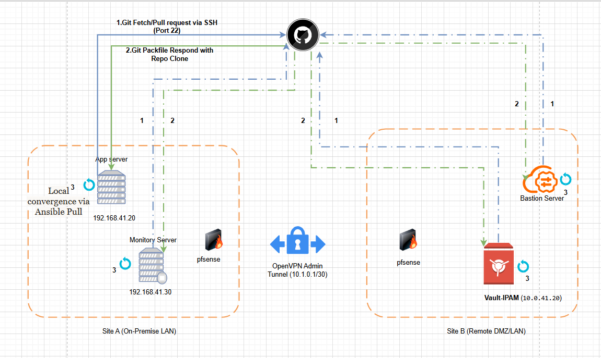

# Documentation Technique : Automatisation GitOps & Stratégie Ansible Pull

## Présentation du projet

Ce projet met en œuvre une architecture **GitOps sécurisée** permettant l'automatisation de la configuration des infrastructures via **Ansible Pull**.

L'objectif principal est de garantir :

- une **automatisation déclarative**
- une **sécurité réseau renforcée**
- une **résilience des nœuds**
- une **reproductibilité complète de l'infrastructure**

L'infrastructure est répartie entre deux sites :

- **Site A : On-Premise LAN**
- **Site B : Remote DMZ**

Les deux sites communiquent via un **tunnel sécurisé OpenVPN**.

---

# Architecture du système

## Diagramme d'architecture

*Figure : Architecture GitOps utilisant Ansible Pull, Bastion Server, Vault-IPAM et un tunnel sécurisé OpenVPN.*

---

# 1. Justification du mode GitOps "Pull"

Dans cette architecture, le choix du **mode Pull** constitue une décision stratégique visant à améliorer la **sécurité et la résilience de l'infrastructure**.

Contrairement au modèle **Push**, les serveurs ne reçoivent pas de commandes depuis un orchestrateur central.  
Chaque nœud vient **chercher lui-même sa configuration** depuis le dépôt Git.

Cette approche apporte plusieurs avantages.

## Sécurité Inbound (Mode furtif)

Chaque serveur initie une **connexion sortante vers GitHub via SSH (port 22)**.

Cela permet au pare-feu **pfSense** de bloquer :

- tout trafic entrant non sollicité
- toute tentative d'accès direct aux serveurs

La surface d'attaque est ainsi **réduite au minimum**.

## Autonomie des nœuds

Chaque serveur possède son propre cycle d'exécution **ansible-pull**.

Cela signifie que :

- les serveurs peuvent **se mettre à jour indépendamment**
- aucune dépendance n'existe vis-à-vis d'un serveur d'orchestration central

Par exemple : si le **Bastion Server** devient indisponible, les serveurs applicatifs continuent de récupérer leurs mises à jour depuis GitHub.

## Traversée NAT native

Les serveurs sont situés dans des **VLANs privés derrière un NAT**.

Le fait d'initier les connexions **de l'intérieur vers l'extérieur** permet :

- d'éviter l'ouverture de ports entrants
- de simplifier la gestion des flux réseau
- de conserver une architecture sécurisée.

---

# 2. GitHub comme Source de Vérité

Le dépôt Git agit comme **Single Source of Truth** pour toute l'infrastructure.

Toute configuration est stockée dans le dépôt :

- playbooks Ansible
- variables
- rôles
- configurations système

L'état réel des serveurs doit toujours correspondre à l'état défini sur la branche principale du dépôt.

## Configuration déclarative

L'infrastructure est décrite de manière **déclarative**.

Les serveurs n'ont qu'à appliquer l'état défini dans Git.

Cela garantit :

- cohérence
- standardisation
- reproductibilité.

## Auditabilité et versioning

Chaque modification de l'infrastructure est enregistrée sous forme de **commit Git**.

Cela permet :

- un historique complet des changements
- une traçabilité des modifications
- la possibilité de réaliser un **rollback immédiat** en cas de problème.

## Reproductibilité (Disaster Recovery)

En cas de perte complète d'une machine virtuelle :

1. déployer un système d'exploitation minimal  
2. installer Ansible  
3. lancer la commande `ansible-pull`

Le serveur récupère alors automatiquement :

- sa configuration
- ses rôles
- ses variables

et **se reconstruit automatiquement**.

---

# 3. Sécurité des accès et gestion des identifiants

La sécurité des accès au dépôt Git repose sur le principe du **moindre privilège (Least Privilege)**.

## Deploy Keys uniques

Chaque serveur possède :

- sa propre **clé SSH**
- enregistrée comme **Deploy Key** dans le dépôt Git.

## Accès en lecture seule

Les clés sont configurées avec **des permissions de lecture seule**.

Ainsi :

- aucun serveur ne peut modifier le dépôt
- un serveur compromis ne peut pas injecter de code malveillant.

## Isolation des accès

Chaque composant possède sa propre clé :

- App Server  
- Bastion  
- Vault

Cela permet une **révocation rapide et ciblée** en cas de compromission.

---

# 4. Rôle du Bastion Server

Dans ce modèle, le Bastion ne joue plus le rôle d'orchestrateur central.

Son rôle est principalement **sécuritaire et administratif**.

## Runner administratif

Le Bastion utilise également **ansible-pull** afin de maintenir :

- ses outils d'administration
- ses configurations système
- ses règles de sécurité.

## Jump Host

Le Bastion agit comme **point d'entrée unique pour l'administrateur**.

## Séparation des flux

Les flux d'automatisation sont séparés des flux d'administration.

Cette segmentation limite les risques de **mouvement latéral** en cas d'attaque.

---

# 5. Analyse des flux GitOps

| Étape | Terme technique | Description |
|------|------|------|
| 1 | Git Fetch / Pull | Requête SSH sortante vers GitHub |
| 2 | Packfile Response | Réception des données compressées du dépôt |
| 3 | Convergence locale | Exécution d'Ansible sur localhost |
| 4 | Secret Fetching | Récupération des secrets via Vault |

---

# 6. Communication inter-sites

Les deux sites sont interconnectés via un **tunnel OpenVPN sécurisé**.

Ce tunnel permet :

- la communication sécurisée entre les infrastructures
- l'accès au serveur Vault
- la synchronisation des ressources.

---

# 7. Composants de l'infrastructure

## Site A – On-Premise LAN

- App Server  
- Monitoring Server  
- Firewall pfSense  

## Site B – Remote DMZ

- Bastion Server  
- Vault-IPAM  
- Firewall pfSense  

---

# Résumé de l'architecture

| Composant | Rôle |
|------|------|
| GitHub | Source de vérité de l'infrastructure |
| Ansible Pull | Automatisation et convergence des serveurs |
| pfSense | Protection périmétrique du réseau |
| Bastion Host | Accès administrateur sécurisé |
| Vault-IPAM | Gestion sécurisée des secrets et IP |
| OpenVPN | Tunnel sécurisé entre les sites |

---

# Conclusion

Cette architecture GitOps permet :

- une **automatisation fiable**
- une **sécurité renforcée**
- une **infrastructure reproductible**
- une **gestion centralisée via Git**

Le modèle **Pull** permet aux serveurs de rester autonomes tout en conservant un haut niveau de sécurité réseau.